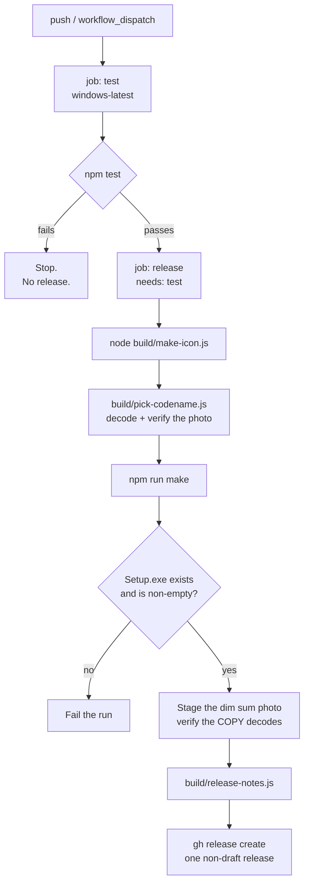

# Continuous integration

## What it does

`.github/workflows/ci.yml` runs on **every push** and on **`workflow_dispatch`**.
It tests, and only if the tests pass, builds the Windows installer and publishes
exactly one release.

## The shape



**A failed test produces no release.** That is enforced structurally by
`needs: test`, not by a conditional inside one job — a release step that is
merely skipped is one `if:` typo away from running.

## The runner

GitHub-hosted `windows-latest`. The app is a Windows Electron application and
the Squirrel maker needs a Windows toolchain, so the hosted Windows image is the
natural fit. No self-hosted runner is used, and none is needed — which also means
no runner on this public repository can be used to execute code on someone's
machine.

Node is pinned to 22 (see [building](building.md) for why).

## The tag

```
v<version>-build.<run_number>
```

`github.run_number` increases by one for every run of this workflow in this
repository and is never reused, so two builds cannot collide on a tag and no
earlier release can be recycled or overwritten.

## The token chain

```yaml
GH_TOKEN: ${{ secrets.RELEASE_TOKEN || secrets.ORG_TOKEN || secrets.GITHUB_TOKEN }}
```

A repository-scoped fine-grained PAT first, then the organization token, then the
workflow token as a last fallback. It is passed **only** through the `GH_TOKEN`
environment convention and is never echoed, logged or written to a file.

`permissions: contents: write` is the minimum needed to create a release.

## No automation loop

**Nothing in this workflow pushes a commit back to this repository.** That is
what keeps a release from retriggering the workflow that produced it, and it is
also why the dim sum code-name mapping is *deterministic* rather than recorded by
a bot — see [releases](releases.md).

The [Pages workflow](../../.github/workflows/pages.yml) deploys through
`actions/deploy-pages`, which likewise pushes no commit.

## Failure modes

| Situation | What happens |
| --- | --- |
| A test fails | The `release` job never starts. No tag, no release, no assets. |
| `npm run make` produces no Setup.exe | The "Locate the built artefacts" step fails the run explicitly rather than publishing an empty release. |
| The dim sum photo does not decode | `pick-codename.js` skips that record. If none is eligible, the release ships without a photo and the run logs a warning — a release is never blocked by the catalog. |
| The code-name sequence is exhausted | The release ships with its version alone and the notes say so. No dish is ever reused. |
| `gh release create` is refused | The run fails visibly. The artefacts are still available from the uploaded build artifact, so nothing is lost. |
| Two pushes in quick succession | `concurrency` groups by ref **without** cancelling in progress, so both produce their own release under their own run number. |
| A push to a branch | Also builds and releases, under its own tag, targeting that commit. Every push publishes a release by design. |

## Security considerations

- **The token is never printed.** No step echoes it, interpolates it into a
  command line, or writes it to a file.
- **No self-hosted runner**, so the standing risk of a public repository
  executing untrusted code on a persistent machine does not exist here.
- **No `pull_request` trigger on a privileged job.** The workflow runs on push
  and dispatch, both of which require write access.
- **Submodules are not checked out.** `vendor/winscp` is the upstream porting
  reference; not fetching it keeps the build fast and reduces what the runner
  pulls in.
- **Artefacts are supplementary, not the deliverable.** Assets move via
  `gh release create`, not by shuttling artifacts between jobs.

## Verification

The workflow has **not** been run — this documentation is written before any
push exists to trigger it, and **CI status is unverified until a real run
appears**. What *has* been verified locally, with real output:

- `npm run make` produces the installer described in [building](building.md).
- `build/pick-codename.js` resolves a dish and decodes all six catalog images
  (`1254x1254` each).
- `build/pick-codename.js --index 7` correctly reports the sequence exhausted
  rather than reusing a dish.
- `build/release-notes.js` composes notes from a real artefact path and a real
  catalog entry.

No claim is made here that CI is green. See [`HANDOFF.md`](../../HANDOFF.md).

## Suggested articles

- [Releases](releases.md) — what a successful run publishes.
- [Building](building.md) — the same build, locally.
- [The installer](installer.md) — the artefact CI ships.
- [The dim sum surprise](../accessibility-and-languages/dim-sum.md) — the catalog CI reads.
