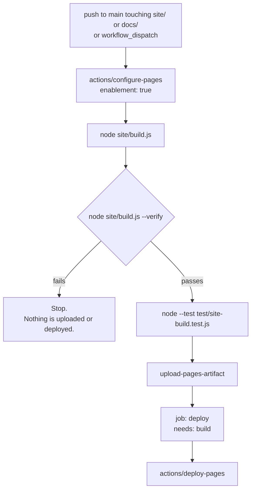

# The documentation site

The Material 3 landing page and documentation site: how it is built, how it is
checked, and how it is published.

## What it does

`site/build.js` emits a complete static site into `site/_site/`:

```sh
node site/build.js                 # build
node site/build.js --base /x/      # override the published path prefix
node site/build.js --verify        # build, then check the emitted output
node site/build.js --serve         # build and serve _site on localhost:8080
```

The articles are **generated from `docs/`** rather than duplicated, so the site
and the repository cannot drift apart: add a feature article under `docs/` and
it appears on the site. Everything is bundled locally — no CDN script,
stylesheet, font or remote image, and no analytics of any kind.

## The base path

The site is published at `https://<owner>.github.io/<repo>/`, not at a domain
root. A static site that hardcodes a root and emits `/app.css` **builds green,
deploys green, and 404s on every asset** — the browser fetches the file from the
domain root, where nothing lives.

So the prefix is configurable at three levels, in order of precedence:

| Source | Used for |
| --- | --- |
| `--base /x/` | A one-off local build |
| `SITE_BASE` | CI, which takes it from Pages itself |
| `base` in `site/config.json` | The default, `/material-winscp/` |

`normalizeBase()` reduces any of them to exactly one leading and one trailing
slash, so `material-winscp`, `/material-winscp` and `//material-winscp//` all
mean the same thing.

## What `--verify` checks

It reads the **emitted bytes**, never the configuration — a config that merely
*says* the right base cannot satisfy it.

| Check | Why |
| --- | --- |
| `index.html` exists and references `app.css`, `app.js` and `content.js` **with the prefix** | Those three are the page. |
| No root-absolute URL lacks the base prefix, in any emitted HTML, CSS or JS | The green-deploy-404. |
| Every referenced local file exists in the output | A reference to a file that was never built. |
| Every ES module `import` resolves to an emitted file, relative to its importer | A module import is a fetch that appears in no `src=`, `href=` or `url()`. One missing `lib/` file fails the whole module graph — a blank page, not a degraded one. |
| No bare specifier (`node:fs`, a package name) and no cross-origin import | Works in Node, silently does not work in a browser. |
| No `{{PLACEHOLDER}}` survived | A text file that reached the output down a path that does not substitute. |
| Nothing fetches another host — `src`, `<link href>`, `url()`, `@import` | Bundle everything locally. |
| `content.js` parses, and was generated for the same base as the markup | Half the links resolving is worse than none. |
| Every catalogued dim sum image is present | The photo ships from the repository or not at all. |

**Every problem is collected and printed together, then the process exits 1.**
Nothing in the verifier throws on a missing file: the single most likely thing
to be missing is a file `index.html` references, and reporting that by crashing
reports nothing at all. An earlier version read `app.js` unconditionally and
died `ENOENT` a dozen lines before its own "referenced file is missing from the
output" report — which is how a site with no client code survived in the tree
while `--verify` looked like it was passing.

## The client application

`site/src/` now contains `app.js`, `app.css` and `lib/` — the Material 3 client
that renders the generated articles. Its own article is
[the site's client application](site-app.md); this one stays about the builder.

A verify run today says:

```
VERIFY OK
  ✔ every fetched URL carries the base prefix /material-winscp/
  ✔ every referenced local file exists in the output
  ✔ no placeholder survived the build
  ✔ no remote subresource is fetched at runtime
  ✔ 12 categories, 58 articles, 6 bundled images, 27 files
```

It did not always. Until the application was written, the same command reported
`app.js` and `app.css` missing and exited 1 — and before the verifier stopped
throwing, it died `ENOENT` without printing a report at all.

## The installer download button

The landing page carries a download button **only when the builder can prove
what it points at**, and the proof is a manifest:

| | |
| --- | --- |
| Where it comes from | `gh release view --json tagName,name,publishedAt,isDraft,assets`, run by `pages.yml` into `site/release.json` |
| Where the builder looks | `--release <file>`, then `SITE_RELEASE`, then `site/release.json` |
| Committed? | **No.** It is git-ignored. A checked-in copy is stale the moment the next release ships, and a stale download link 404s. |
| Validation | Every asset URL must start with `<repository>/releases/download/<tag>/`. Anything else — a mutable `latest` link, another host, a draft — is dropped. |
| No manifest | No `release` data in `content.js`, so the page shows **no button** and says it will not guess a URL. |

The failure this design refuses is the tempting one: assembling
`.../releases/latest/download/Setup.exe` out of the version number. That link
builds green, deploys green, and 404s the first time an asset is named anything
other than what was guessed — and a download button that does not download is
worse than no button, because the reader concludes the project does not ship.

## Publishing

`.github/workflows/pages.yml` builds, verifies and deploys.



- **Runner:** GitHub-hosted `ubuntu-latest`. The builder needs nothing but
  `node:fs` and `node:path`, so there is no `npm ci` and no Windows toolchain.
- **Trigger:** pushes to `main` that touch the site's inputs, plus
  `workflow_dispatch`. `tags-ignore: ['**']` is kept alongside the branch filter
  because publishing must never retrigger a build — this repository once turned
  four commits into nine releases exactly that way (see [CI](ci.md)).
- **Base path:** taken from `steps.pages.outputs.base_path`, not guessed. An
  empty value falls back to `site/config.json`.
- **Token chain:** `secrets.RELEASE_TOKEN || secrets.ORG_TOKEN ||
  secrets.GITHUB_TOKEN`, passed to `actions/configure-pages` and never echoed.
  The ephemeral workflow token cannot *enable* Pages on a repository that has
  never had it, which is why the chain is needed at all.
- **Permissions:** `contents: read`, `pages: write`, `id-token: write`. Nothing
  here pushes a commit, creates a tag, or publishes a release.

## Failure modes

| Situation | What happens |
| --- | --- |
| A referenced file was never built | Reported by name, with the file that references it. Exit 1, no deploy. |
| An asset URL lost the base prefix | Reported with the file, the URL and the expected prefix. Exit 1, no deploy. |
| A stylesheet in a subdirectory `@import`s a remote font | Reported. Exit 1, no deploy. |
| `content.js` is unparseable | Reported as a problem; the verifier returns instead of throwing. |
| The output directory does not exist | Reported as a problem, not an exception. |
| Pages is not enabled on the repository | `configure-pages` enables it with the token chain. If the token is refused the job fails visibly rather than deploying nowhere. |
| A push to a branch other than `main` | Nothing happens. One live site, published from one branch. |

## Security considerations

- **No remote subresource, enforced rather than remembered.** The verifier
  fails the build on a fetched cross-origin `src`, `<link href>`, `url()` or
  `@import`, so a CDN font cannot arrive quietly in a later change.
- **`<a href>` is deliberately not flagged.** A link a user clicks is
  navigation, not a fetch; flagging it would make the repository link in the
  page footer a build failure.
- **The token is never printed.** It is passed as an action input only.
- **No `pull_request` trigger.** The workflow runs on push to `main` and on
  dispatch, both of which require write access.
- **The output is served, not executed, and the app is hash-routed.** `404.html`
  redirects back into the site rather than exposing the host's 404 page.

## Verification

Verified locally, with real output, at the time of writing, on Node 26.5.1 and
on Node 22.23.2 (the version CI pins):

- `node site/build.js --verify` builds 12 categories and 58 articles and exits
  **0** with `VERIFY OK`. Before the client application existed the same command
  reported both missing files and exited 1; before the collecting rewrite it
  died with an `ENOENT` stack trace and printed no report at all.
- `node --test test/site-build.test.js` — **31 tests, 31 passing** (was 22).
  Against the previous `site/build.js` the five release-manifest tests and the
  two module-import tests fail; the rest of the suite is the earlier change's.
- `node --test test/site-app.test.js` — **36 tests, 36 passing**, covering the
  client application. With `site/src/lib/`, `app.js` and `app.css` moved aside,
  0 pass and 36 fail.
- The download button was exercised against a **real** manifest generated with
  `gh release view`: it rendered
  `https://github.com/Ding-Ding-Projects/material-winscp/releases/download/v0.1.464/WinSCP.Material.0.1.464.Setup.exe`,
  labelled `Download for Windows · Version 0.1.464 · 125.9 MB`. The manifest was
  then deleted, and the page fell back to no button.
- The workflow itself is **unverified**: no run exists yet, and GitHub Pages is
  still not enabled on the repository. No claim is made here that the site is
  live. See [`HANDOFF.md`](../../HANDOFF.md).

## Suggested articles

- [The site's client application](site-app.md) — what actually runs in the browser.
- [Continuous integration](ci.md) — the other workflow, and the release loop this one avoids.
- [Building](building.md) — building the application rather than the site.
- [Search and regex](../search-and-regex/) — the builder every search bar on the site has to reach.
- [The dim sum surprise](../accessibility-and-languages/dim-sum.md) — the catalog the site bundles.
