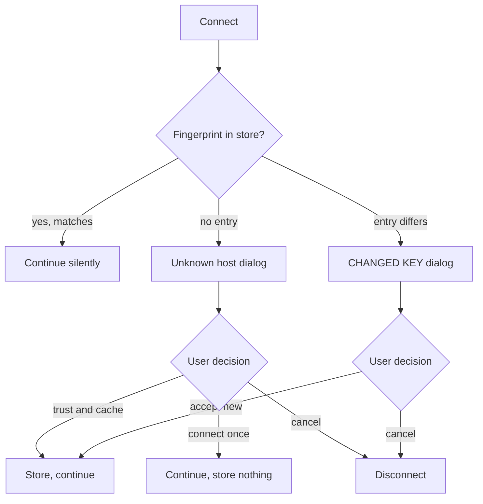

# Host keys and certificates

## What it does

Before any credential is sent, the app verifies that the server is the one you
connected to last time. For SSH that means a host key fingerprint; for TLS
(FTPS, WebDAVS, S3) it means a certificate chain and fingerprint.

Accepted fingerprints are stored in `hostkeys.json` (see `design/main/paths.js`)
with the host, port, algorithm and the date of acceptance.

## The verification flow

Both dialogs are **modal**, and correctly so: this is a decision the user must
make before anything else can happen. Everything else in this application that
merely informs is a corner notification; this is not that.

Neither dialog defaults to Accept, and neither has a "don't ask again" that
covers future *changes*.

## Configuration

| Option | Default | Meaning |
| --- | --- | --- |
| `hostKey` (per site) | `''` | Pin an expected fingerprint. A mismatch fails without a prompt. |
| `hostKeyList` (per site) | ed448, ed25519, ecdsa, rsa, dsa, **WARN** | Preferred host key algorithms. |
| `fingerprintScan` (per site) | `true` | Collect the server's other key types on first connect, so a later algorithm change is not mistaken for a compromise. |
| `tunnelHostKey` | `''` | The same pin for a jump host. |
| `tlsCertificateFile` | `''` | Client certificate for mutual TLS. |
| `minTlsVersion` / `maxTlsVersion` | `tls10` / `tls13` | Negotiated version window. |

Pinning `hostKey` is the strongest option available: an unattended or scripted
connection should always use it, because a prompt nobody sees is a prompt nobody
answers.

## What the dialogs show

- The **SHA-256 fingerprint**, in the same format `ssh-keygen -l` prints, so it
  can be compared against a value obtained out of band.
- The key algorithm and size.
- For a changed key: **both** fingerprints, old and new, with the date the old
  one was accepted.
- For certificates: subject, issuer, validity window, SHA-256 fingerprint, and
  the specific reason validation failed (expired, self-signed, name mismatch,
  unknown issuer) — one reason, not "certificate error".

## Failure modes

| Situation | What the user sees | Recoverable |
| --- | --- | --- |
| First connection to a host | Unknown host dialog. Trusting without out-of-band verification is trust-on-first-use — the dialog says so plainly. | n/a |
| Key changed after a server rebuild | Changed-key dialog. Legitimate and common; also exactly what an interception looks like. Verify out of band. | Yes |
| Key changed during automatic reconnect | Reconnection **stops** and asks. Never auto-accepted. | Yes |
| Server offers a different algorithm than the cached one | With `fingerprintScan`, recognized as the same server. Without it, it looks like a change and prompts. | Yes |
| Pinned `hostKey` mismatch | Connection fails immediately, no prompt. That is what pinning means. | Only by correcting the pin |
| Expired certificate | Named as expired, with both dates. Accepting stores the fingerprint, not a blanket exemption. | Yes |
| Certificate name mismatch | Names the certificate's subject and the host asked for, side by side. | Yes |
| `hostkeys.json` deleted | Every host becomes unknown again. Data loss, not a security failure — but it does erase the ability to notice a change. | Yes, by re-verifying |
| Two sites on the same host, different ports | Stored per host **and** port. A tunnel to `localhost:port` records the real host, not the forwarded port. | n/a |

## Security considerations

- **Trust-on-first-use is a real limitation, and it is stated rather than
  glossed.** The only genuinely safe first connection is one whose fingerprint
  you obtained another way.
- **A changed key is never accepted automatically, in any code path** —
  interactive, reconnect, workspace restore or queued transfer. There is no
  setting to make it so.
- **Algorithms after `WARN` in `hostKeyList` are weak.** Selecting one produces a
  named warning. The marker's position is meaningful.
- **The store is per host and port**, so a forwarded local port cannot be used to
  make one server's key vouch for another's.
- **Accepting a bad certificate pins that certificate**, not the failure reason.
  The next, different bad certificate prompts again.
- **`hostkeys.json` is integrity-relevant, not secret.** It contains no
  credentials; what matters is that it is not silently modified. It lives in the
  app's own data directory with the user's permissions.

## Verification

- Fingerprint formatting is tested against `ssh-keygen -l` output for RSA,
  ECDSA, Ed25519 and Ed448 keys.
- Store lookup is tested for host/port separation and algorithm variants.
- The "changed key halts every automatic path" rule has direct tests for
  reconnect, workspace restore and queued-transfer reconnect.
- Certificate validation failure classification is tested for expiry,
  self-signature, name mismatch and unknown issuer, each producing its own
  message.
- Pinned-mismatch is tested to assert no prompt is shown at all.

## Suggested articles

- [Credential storage](credential-storage.md) — what is sent *after* verification succeeds.
- [Reconnection](../sessions-and-sites/reconnection.md) — why a key change stops a retry loop.
- [Tunnels and proxies](../sessions-and-sites/tunnels-and-proxies.md) — pinning a jump host.
- [SFTP](../protocols/sftp.md) and [FTP](../protocols/ftp.md) — the algorithm and TLS options.
