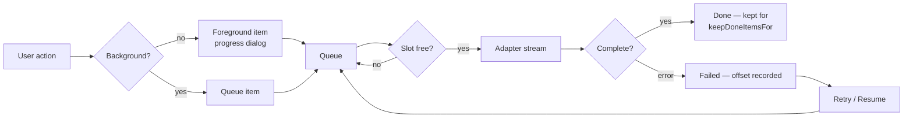

# Transfers and the queue

Everything that moves bytes goes through the queue in `design/main/queue.js`.
There is no "quick" path that bypasses it: a double-click download and a
thousand-file recursive upload are the same mechanism with different item
counts, which is why pausing, throttling and resuming work uniformly.

## Articles

| Article | Covers |
| --- | --- |
| [queue.md](queue.md) | Queue mechanics: parallelism, ordering, pause/resume, on-empty actions. |
| [transfer-settings.md](transfer-settings.md) | Every transfer option, and the named presets that bundle them. |
| [resume.md](resume.md) | Resume, `.filepart` files, overwrite modes and what each protocol can actually do. |
| [speed-limits.md](speed-limits.md) | Per-transfer and global throttling, and how the limit is enforced. |

## The shape of a transfer

An item carries its own copy of the transfer settings it was created with, so
changing the defaults mid-queue never retroactively alters something already
queued. That is deliberate: a user who lowers a speed limit expects it to apply
to what happens next, not to reinterpret what they already asked for.

## Postman

Not applicable — this project exposes no HTTP API. See the
[documentation index](../README.md).

## Suggested articles

- [Protocols](../protocols/) — what supplies the streams, and which capabilities constrain the queue.
- [Synchronization](../synchronization/) — the other producer of queue items.
- [File masks](../editing-and-commands/file-masks.md) — the include/exclude language transfers use.
