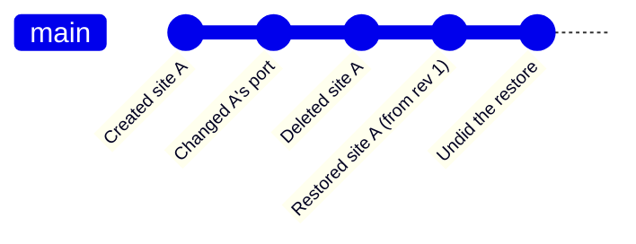

# Restore

## What it does

Brings back a previous state — one record, a group of records, or the whole
configuration — from any revision in the history.

## The append-only rule

**Restoring writes a new revision. It never rewrites history.**

So an undo can be undone, and that undo undone in turn. This is not a
philosophical nicety: a destructive "restore" that discards the branch it
replaced makes the history panel unsafe to use, because the user cannot
experiment without risking the state they started from. Nobody explores a history
that might eat their present.

Every one of those is a revision. Nothing was removed to make room for anything.

## Granularity

| Scope | Behaviour |
| --- | --- |
| One record | Restores that site, preset, command or theme alone. |
| A group | For example a site folder and everything in it. |
| Settings only | Restores configuration without touching records. |
| Whole configuration | Everything as of that revision. |

The restore preview shows exactly what will change — created, modified, deleted —
before anything happens, with counts.

## Encrypted state

This is the subtlest bug in the whole feature, and it is worth stating plainly
because it fails in a way that looks exactly like data corruption.

The history stores encrypted fields as opaque ciphertext. Restoring a snapshot
preserves the site IDs and ciphertext bytes; it does not decrypt credentials or
re-encrypt them against a new array position. If record-bound authenticated
data is added in the future, it must use a stable site identifier rather than
an autoincrement row id or array index, because:

1. The record is deleted.
2. It is restored, and receives a **fresh id**.
3. The AAD no longer matches.
4. The data becomes permanently undecryptable — and the failure is
   indistinguishable from corruption.

the restored record would otherwise fail authentication after delete and restore.

## Failure modes

| Situation | What the user sees | Recoverable |
| --- | --- | --- |
| Restoring a record that still exists | Treated as a modification, previewed as such, and given a new revision. Nothing is duplicated. | Yes |
| Restoring a record referencing something since deleted (a site's key file, a workspace's site) | Restored with the dangling reference flagged, not silently dropped. Dropping data to make a restore tidy loses more than it fixes. | Yes |
| Restoring settings from a much older version | Unknown keys are preserved, missing keys take current defaults, and the summary lists both. | Yes |
| A protected secret cannot be decrypted after restore | Reported per record. With the stable-identifier binding this should not happen; if it does, it is reported honestly rather than silently producing a site that fails to connect. | Depends |
| Restoring while a session from that site is open | The open session keeps its live settings; the restore applies to the stored record. The panel says so. | n/a |
| Restore interrupted | Applied atomically through the same temp-then-rename write as the configuration. Either it happened or it did not. | Yes |
| Restoring a revision from a pruned range | Not possible; the panel states the oldest retained revision. | No |

## Security considerations

- **Restoring a host key trust decision restores a trust decision.** It is
  presented as such, with the fingerprint, so nobody re-trusts a key they
  deliberately revoked without noticing.
- **Restoring settings can weaken security** — re-enabling plain FTP on a site,
  lowering a TLS minimum, turning on `logSensitive`. The preview highlights
  security-relevant changes separately from cosmetic ones.
- **Restore never decrypts to disk.** Ciphertext moves as ciphertext; the master
  password is needed to *use* a restored credential, not to restore it.
- **The append-only rule is a security property too**: an attacker with access to
  the app cannot use restore to erase evidence of what they changed, because
  restoring adds rather than removes.

## Verification

- **The delete-and-restore AAD case has a dedicated test**: create a record with
  a protected secret, delete it, restore it, and assert the secret still
  decrypts.
- Undo-of-an-undo is tested to three levels, asserting each is a new revision and
  none rewrites history.
- Preview counts are asserted to equal what actually changes.
- Dangling-reference flagging is tested by deleting a referenced record between
  snapshot and restore.
- Atomicity is tested by interrupting a restore.
- Security-relevant change highlighting is tested for a set of known settings.

## Suggested articles

- [Snapshots](snapshots.md) — what is captured, and when.
- [The history panel](history-panel.md) — where a restore is initiated.
- [Credential storage](../security-and-credentials/credential-storage.md) — the AAD binding, from the other side.
- [Host keys](../security-and-credentials/host-keys.md) — why restoring a trust decision is highlighted.
